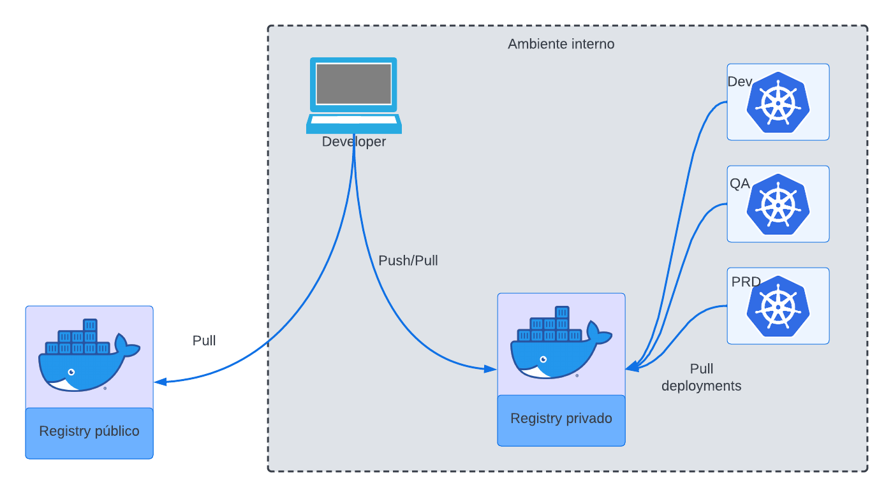

---
hide:
  - toc
---

### Sobre Docker Registry

Em diversas linguagens de programação, há a necessidade de compartilhar bibliotecas e códigos entre os usuários. Uma das principais formas de compartilhamento de código são repositórios que distribuem artefatos pré compilados, como por exemplo:

- [mvn](https://mvnrepository.com/)
- [pypi](https://pypi.org/)
- [npm](https://www.npmjs.com/)
- [yarn](https://yarnpkg.com/)

Com `Docker` não é diferente. Existem repositórios públicos e privados para a distribuição de imagens entre usuários e servidores.

Esses repositórios podem ser usados como um serviço (nuvem) com ou sem autenticação de usuários, ou repositórios internos. Isso vai depender muito da definição da estratégia de como esses artefatos devem ser distribuídos entre desenvolvedores.


Seguem alguns exemplos de repositórios:

- [Docker Hub](https://hub.docker.com/)
- [Azure Container Registry](https://azure.microsoft.com/en-us/products/container-registry/)
- [JFROG](https://jfrog.com)
- [Google Cloud Registry](https://cloud.google.com/container-registry?hl=pt-br)
- [Amazon Cloud Registry](https://aws.amazon.com/pt/ecr/)
- [Github Container Registry](https://docs.github.com/en/packages/working-with-a-github-packages-registry/working-with-the-container-registry)

Entre muitos outros.

Veja o diagrama abaixo:
<figure markdown>
  { width="700" align=left}
<figcaption>Diagrama simples de um fluxo de registry</figcaption>
</figure>

Perceba que no desenho, temos um notebook ilustrando um computador local de um desenvolvedor, que utiliza imagens de um `registry` público para desenvolver. No fim do desenvolvimento, essa imagem é enviada a um `registry` privado e depois consumido por diversos ambientes Kubernetes.

#### Pull e Push de imagens

O processo de `pull` e `push` é exatamente o mesmo do `git`:

- pull: Download
- push: Upload

> Usando o computador local como ponto de referência com para o serviço. Exemplo notebook -> Github

1. Para fazer o `pull` de uma imagem:
```shell
$ docker pull nginx:alpine
```

2. Para fazer o `push` de uma imagem:
```shell
$ docker push $registry/$app:$tag
```

Ao fazer `push` para um registry, é necessário incluir o endereço do registry no momento da tag da imagem, o `/` separa o nome do registry com o nome da aplicação/usuário e após o `:` é onde está definida a versão da imagem. Todos esses atributos são necessários para enviar uma imagem ou fazer um `pull` de um registry.
